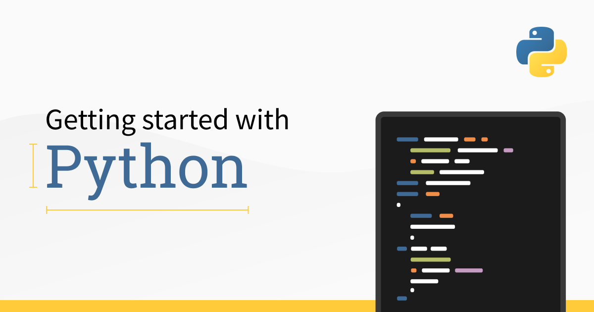

  

# Python Programming Language

This is simple documentation on python programming language. I create this documentation on my way. I try to understand the python in deep and took down documentation.



## Table of Content

- [Basic](#Basic)
  - [Basic Function](#Basic_Function)
  - [Comment](#Comment)
- [Variable](#Variable)
  - [Casting](#Casting)
  - [Multiple_Assign](#Multiple_Assign)
  - [Global_Variable](#Global_Variable)
- [Datatype](#Datatype)
  - [Number](##Number)
  - [Type](##Type)
  - [Random Number](##Random_Number)
- [String](#String)
  - [String Array](##String_Array)
  - [Loop String](##Loop_String)
  - [String Len](##String_Len)
  - [Check String](##Check_String)
  - [String Method](##String_Method)
  - [String Concatenate](##String_Concatenate)
  - [String Format](##String_format)
  - [Escape_Characters](##Escape_Characters)
- [Boolean](#Boolean)
  - [Truthy And Falsy Value](##Truthy_And_Falsy_Value)
- [Operators](#Operators)
  - [Arithmetic Operator](##Arithmetic_Operator)
  - [Assignment Operator](##Assignment_Operator)
  - [Comparison Operator](##Comparison_Operator)
  - [Logical Operator](##Logical_Operator)
  - [Identity Operator](##Identity_Operator)
  - [Membership Operator](##Membership_Operator)
- [List](#List)
  - [List CRUD](##List_CRUD)
  - [List Loop](##List_Loop)
  - [List Comprenhension](##List_Comprenhension)
  - [Sort List](##Sort_List)
  - [Copy List](##Copy_List)
- [Tuples](#Tuples)
  - [Update Tuples](##Update_Tuple);
  - [Unpacking Tuples](##Unpacking_Tuples)
  - [Tuples Join](##Tuples_Join)
  - [Tuple Methods](##Tuple_Methods)
- [Sets](#Sets)
  - [Access Sets](##Access_Sets)
  - [Set Methods](##Set_Methods)
  - [Sets Join](##Sets_Join)
- [Dictionaries](#Dictionaries)
  - [Access Dictionary](##Access_Dictionary)
  - [Dictionary Add Item](##Dictionary_Add_Item)
  - [Dictionary Remove Item](##Dictionary_Remove_Item)
  - [Traverse Dictionary](##Traverse_Dictionary)
  - [Copy Dictionary](##Copy_Dictionary)
  - [Nested Dictionary](##Nested_Dictionary)
- [if else](#if_else)

# Basic

Let's see the basic python program :

**_Porgram : hello, world!_**

```python
print("Hello, World!");
```

**_Output : hello, world!_**

```
Hello, World!
```

### Basic Function

Let's see some built in python basic function :

| Function | Description      |
| -------- | ---------------- |
| print    | print something  |
| input    | input something  |
| int      | convert integare |
| float    | convert float    |
| str      | convert string   |

Python input everything as string.

```python
print("Something print"); # something print

# something input
# input("Something input");

# print number
print(int("30"));

# print float
print(float("40"));

# print string
print(str(40));
```

**_Output_**

```python
Something print
30
40.0
40
```

## Comment

Comment in python is simple. Just use # symbol before the comment. Then python ignore this code. Multiline comment start with ''' and end with ''' or another way is start with """ and end with """.

**_Program : comment_**

```python
# single line comment.

"""
this is a multiline comments
"""

'''
another multiline comments
'''
```

Python will ignore this code.

# Variable

Variable is something which contain value.Rule to use variable :

**_Program : variable_**

```python
variable = "value";

# number type variable
number = 30;

# float type variable
number_float = 30.23;

# string type variable
string = 'This is string';

print(number);
print(number_float);
print(string);
```

**_Output : variable_**

```
30
30.23
This is string
```

**_Rule to take variable name :_**

1. Variable name can not start with number
1. Can not include speacial symbol ("#@!))
1. Can not use reserve keyword
1. Can not include space

## Casting

In python we can casting variable.

| Casting Keyword | work             |
| --------------- | ---------------- |
| int             | convert integare |
| float           | convert float    |
| str             | convert float    |

**_Program : variable_**

```python
# convert integare
print(int("30"));

# convert float
print(float(30));

# convert string
pritn(str(30302));
```

**_Output : variable_**

```
30
30.0
30302
```

## Multiple Assign

In python we can assign variable mutliple value in one time.

**_Program : multiple assign_**

```python
x,y,z = 32,31,23;
list = ['Apple','Benana','Mango'];
a,b,c = list;

print(">>> x y z <<<");
print("> x : " + str(x));
print("> y : " + str(y));
print("> z : " + str(z));

print("\n>>> a b c <<<");
print("> a : " + a);
print("> b : " + b);
print("> c : " + c);
```

**_Output : multiple assign_**

```
>>> x y z <<<
> x : 32
> y : 31
> z : 23

>>> a b c <<<
> a : Apple
> b : Benana
> c : Mango
```

## Global_Variable

Global vriable is which can declear outside the function. If we can access global variable inside the function with global keyword.

**_Program : global variable_**

```python
# create global variable inside the function
def one():
    global x;
    x = "This is global Variable.";
def two():
    global x;
    x = "This is changing global Variable."

# calling function
one();
print("x : "+x);

# changing global variable by calling function
two();
print("x : "+x);
```

**_Output : global variable_**

```
x : This is global Variable.
x : This is changing global Variable.
```

# Datatype

Python have lot's of datatype.In here list of datatype in python.

| Datatype      | Type                        |
| ------------- | --------------------------- |
| Text Type     | str                         |
| Numeric       | int,float,complex           |
| Sequence      | list,tuple,range            |
| Mapping Type  | dict                        |
| Set Types     | set, frozenset              |
| Boolean Types | bool                        |
| Binary Types  | bytes,bytesarray,memoryview |

Let's see text,numeric, sequence and boolean datatypes :

**_Program : some datatype_**

```python
# numberic type
int_number = 30;
float_number = 32;
complex_number = 321j;

print("int : ",int_number);
print("float : ",float_number);
print("complex_number : ",complex_number);

# text type
string = "Md Tazri";
print("string : ",string);

# Boolean type
boolean = True;
print("Boolean : ",boolean);

# sequence type
list = [32,21,"Tazri"];
tuple = {32,21,21};
range_type = range(5);
print("List : ",list);
print("tupple : ",tuple);
print("range :",range);
```

**_Output : some datatype_**

```
int :  30
float :  32
complex_number :  321j
string :  Md Tazri
Boolean :  True
List :  [32, 21, 'Tazri']
tupple :  {32, 21}
range : <class 'range'>
```

## Number

Python have 3 type of number type variable.

- Integare (int)
- Float (float)
- Complex (complex)

We already see who to use those number. Now we see how to typecasting.

**_Program : number typecasting_**

```python
number_int = int("32");
number_float= float(32);
number_complex = complex(3222342332432435435345324435324523423);

print("number int : ",number_int);
print("number float : ",number_float);
print("number complex : ",number_complex);
```

**_Output : number typecasting_**

```
number int :  32
number float :  32.0
number complex :  (3.222342332432435e+36+0j)
```

## Type

type function to see the type of data. It's show the class name. Let's see example :

**_Program : type_**

```python
number_int = int("32");
number_float= float(32);
number_complex = complex(3222342332432435435345324435324523423);

print(type(number_int),": ",number_int);
print(type(number_float),": ",number_float);
print(type(number_complex),": ",number_complex);
```

**_Output : type_**

```
<class 'int'> :  32
<class 'float'> :  32.0
<class 'complex'> :  (3.222342332432435e+36+0j)
```

## Random_Number

If we create random number in pythen then we first import random library. Which is python builtin library.

**_Syntax :_**

```
import random
random.randrange(start,end)
```

**_Program : random number_**

```python
import random;

# number from 1 to 10
print(random.randrange(1,10));

# number from 5 to 106 int
print(random.randrange(5,106));
```

**_Output : random number_**

```
9
70
```

# String

String is which text is start single or double qoutation and end with it. Even if it call string if nothing is double and single qoutation.

**_Program : simple string_**

```python
double_qoute_string = "This is a string with double qoute";

single_qoute_string = 'This is a string with single qoute';

three_qoute_string = '''
This is a string with single qoute.
'''

three_double_qoute_string = """
This is a string with three double qoute.
"""

print(double_qoute_string);
print(single_qoute_string);
print(three_qoute_string);
print(three_double_qoute_string);
```

**_Output : simple string_**

```
This is a string with double qoute
This is a string with single qoute

This is a string with single qoute.


This is a string with three double qoute.

```

## String_Array

We can access string like array.

**_Syntax access string element_**

```
string = "name"

in here every element index is
n = 0
a = 1
m = 2
3 = 3

access 3nd element like
string[2]

access like
string[index]
```

**_Speacify access string element_**

```
string = "name"
string[index];
string[-2]; mean it count reverse

reverse index
e = -1
m = -2
a = -3
n = -4
```

**_Select Range syntax_**

```
string = "name"
string[start_index : end_index];

by default,
start_index = 0
end_index = -1

string[1:]
output : "ame"
string[1:3]
output : "am"
```

**_Select Reverse syntax_**

```
string = "name"
string[::-1]
it print the string reverse
output : "eman"
```

**_Program : access string array_**

```python
name = "Md Tazri";

print("name : ",name);
print("name[0] : ",name[0]);
print("name[-1] : ",name[-1]);
print("name[2:] : ",name[2:]);
print("name[:3] : ",name[:3]);
print("name[3:-2] :",name[3:-2]);
print("name[::-1] : ",name[::-1]);
```

**_Output : access string array_**

```
name :  Md Tazri
name[0] :  M
name[-1] :  i
name[2:] :   Tazri
name[:3] :  Md
name[3:-2] : Taz
name[::-1] :  irzaT dM
```

**_Important thing about string_**

1. String act like array only access element case.
1. We can not change string element.
1. String is unmutable in python.

## Loop String

We also traverse string with loop.

**_Program : loop string_**

```python
my_name = "Md Tazri";

for l in my_name :
    print("Letter ",l);
```

**_Output : loop string_**

```
my_name = "Md Tazri";

for l in my_name :
    print("Letter ",l);
```

## String_Len

We can see string length by len function.

**_Program : string len_**

```python
name = "Md Tazri";
print("len(name) : ",len(name));
```

**_Output: string len_**

```
len(name) :  8
```

## Check String

'in' and 'not in' character to check substring exist in another string.

**_Syntax :_**

```
string = 'something write';
sub_string = 'sub';

# checking
sub_string in string;
## if sub_string exist in string it must be return true other way it return false.

sub_string not in string;
## if sub_string can not exist in string it must be return true other wish it return false.
```

**_Program : check string_**

```python
sentence = "My name is tazri and i live in comilla.";

print("sentence : ");
print(sentence);
print("'tazri' in sentence : ");
print('tazri' in sentence);
print("'focus' in sentence : ");
print('focus' in sentence);
print("'focus' not in sentence : ");
print('focus' not in sentence);
print("'tazri' not in sentence : ");
print('tazri' not in sentence);
```

**_Output : check string_**

```
My name is tazri and i live in comilla.
'tazri' in sentence :
True
'focus' in sentence :
False
'focus' not in sentence :
True
'tazri' not in sentence :
False
```

## String_Method

Here some string method :
| Method | work |
|--------------|-----------------------------------|
| capitalize | convert first letter uppercase |
| lower | convert string lower case |
| upper | convert string upper case |
| title | convert string like header |
| casefold | convert string lower case |
| count | search subtring how many time |
| find | return start position of sub str |
| replace | it replace old sub string by new sub string |
| strip | remove white space from start to end |

**_Program : string methods 1_**

```python
sentence = "my name is Md Tazri and I am Student.Do you know me ? i want to be a programmer.";

print("sentence : ");
print(sentence);

# make capital first letter
print("\n\nsentence.capitalize()");
print(sentence.capitalize());

# make string upper
print("\n\nsentence.upper()");
print(sentence.upper());

# make string lower case
print("\n\nsentence.lower()");
print(sentence.lower());

# make string title
print("\n\nsentence.title() : ");
print(sentence.title());

# make string lowercase by casefold
print("\n\nsentence.casefold() : ");
print(sentence.casefold());

# count i how many time
print("\n\nsentence.count('i') : ");
print(sentence.count('i'));

# count 'name' string position 0 to 8
print("\n\nsentence.count('name',0,8)");
print(sentence.count('name',0,8)); ## by default start is 0 and end is -1

# find 'tazri' in string
print("\n\nsentence.find('tazri') : ");
print(sentence.find('tazri'));

# find 'Tazri' in string
print("\n\nsentence.find('Tazri') : ");
print(sentence.find('Tazri'));

# saytax of find is :
# find(value,start_index,end_index);
# by default start = 0 and end is -1
# it return start position of sub_string in string
# if return -1 if sub_string not exist in string
```

**_Output : string method 1_**

```
sentence :
my name is Md Tazri and I am Student.Do you know me ? i want to be a programmer.


sentence.capitalize()
My name is md tazri and i am student.do you know me ? i want to be a programmer.


sentence.upper()
MY NAME IS MD TAZRI AND I AM STUDENT.DO YOU KNOW ME ? I WANT TO BE A PROGRAMMER.


sentence.lower()
my name is md tazri and i am student.do you know me ? i want to be a programmer.


sentence.title() :
My Name Is Md Tazri And I Am Student.Do You Know Me ? I Want To Be A Programmer.


sentence.casefold() :
my name is md tazri and i am student.do you know me ? i want to be a programmer.


sentence.count('i') :
3


sentence.count('name',0,8)
1


sentence.find('tazri') :
-1


sentence.find('Tazri') :
14
```

**_Program : String Methods 2_**

```python
sentence = "My name is md Tazri and I am a simple students nothing else.";
tuple = ('black','yellow','red','dry');


print("sentence : ");
print(sentence);

# replase
'''
replace sayntax
string.replace(value,new_value,count)

by default it replace all old value by new value other wish it replace count time.
'''

print("\n\nsentence.replace('s','t') : ");
print(sentence.replace('s','t'));

print("\n\nsentence.replace('m','l',2) : ");
print(sentence.replace('m','l',2));

# swapcase()
# swapcase return the string where all letter swap from upper to lower and lower to upper.

print("\n\nsentence.swapcase() : ");
print(sentence.swapcase());

# join()
# take iterable object and it join them as string by some thing
# syntax
# value.join(tuple)
# it joint by value every element of iterable object

print("\n\ntuple : ");
print(tuple);
print("\n\n''.join(tuple) : ");
print(''.join(tuple));

print("\n\n'--> '.join(tuple) :");
print('--> '.join(tuple));
```

**_Output : string methods 2_**

```
sentence :
My name is md Tazri and I am a simple students nothing else.


sentence.replace('s','t') :
My name it md Tazri and I am a timple ttudentt nothing elte.


sentence.replace('m','l',2) :
My nale is ld Tazri and I am a simple students nothing else.


sentence.swapcase() :
mY NAME IS MD tAZRI AND i AM A SIMPLE STUDENTS NOTHING ELSE.


tuple :
('black', 'yellow', 'red', 'dry')


''.join(tuple) :
blackyellowreddry


'--> '.join(tuple) :
black--> yellow--> red--> dry
```

**_Program : string methods 3_**

```python
sentence = "      this is string ";

# strip
# remove white spacess from start and end.
print("sentence : ");
print(sentence);

print("\n\nsentence.strip() : ");
print(sentence.strip());
```

**_Output : string methods 3_**

```
sentence :
      this is string


sentence.strip() :
this is string
```

## String_Canecatenate

We can use + operator to canecatenate more than one string. Let's

**_Program : string canecatenate_**

```python
string_one = "Md";
space = " " ;
string_two = "Tazri";

print(string_one+space+string_two);
```

**_Output : string canecatenate_**

```
Md Tazri
```

## String_Format

format is builtin string function which can use for formating string in my own way.

**_Program : string format_**

```python
sentence = "Hey, I {} {} and I am {} year old's.";
sentence_two = "Hey, I am {2} {1} and I am {0} year old's.";
first_name = "Md";
last_name = "Tazri";
age = 17;

print("sentence : ");
print(sentence);

print("\n\nsentence.format(first_name,last_name,age) : ");
print(sentence.format(first_name,last_name,age));

print("\n\nsentence_two : ");
print(sentence_two);

print("\n\nsentence_two.format(age,last_name,first_name) : ");
print(sentence_two.format(age,last_name,first_name));
```

**_Output : string format_**

```
sentence :
Hey, I {} {} and I am {} year old's.


sentence.format(first_name,last_name,age) :
Hey, I Md Tazri and I am 17 year old's.


sentence_two :
Hey, I am {2} {1} and I am {0} year old's.


sentence_two.format(age,last_name,first_name) :
Hey, I am Md Tazri and I am 17 year old's.
```

## Escape_Characters

Here list of escape character in python :

| Character | Description           |
| --------- | --------------------- |
| \'        | print single quote    |
| \"        | print double quote    |
| \\        | print backslash       |
| \n        | print new line        |
| \t        | print tab             |
| \b        | print backspace       |
| \1oo      | for octal value       |
| \xhh      | for hexadecimal value |

**_Program : escape character_**

```python
print("single quote here \'. new line \n double quote here \"")
print("backslash \\");
print("tab \tspace");
print("back \bspace (\\b)");
print("otacl code \133\134");
print("hexa code \x32 \x25");
```

**_Output : escape character_**

```
single quote here '. new line
 double quote here "
backslash \
tab 	space
backspace (\b)
otacl code [\
hexa code 2 %
```

# Boolean

In python boolean value is True or False. and bool function to convert something to boolean.

**_Program : boolean_**

```python
# True and False

print("True : ",True);
print("False : ",False);

print("bool('string') : ",bool('string'));
```

**_Output : boolean_**

```
True :  True
False :  False
bool('string') :  True
```

## Truthy_And_Falsy_Value

Some value's in python bool type is false it's call falsy value. Here list of falsy value:

- ''
- []
- {}
- ()
- 0
- None

Every value in python bool type is True without Above values.

**_Program : falsy value_**

```python
# here some falsy value
print("bool('') : ",bool(''));
print("bool([]) : ",bool([]));
print("bool({}) : ",bool({}));
print("bool(()) : ",bool(()));
print("bool(0)  : ",bool( 0));
print("bool(None) :",bool(None));
```

**_Output : falsy value_**

```
bool('') :  False
bool([]) :  False
bool({}) :  False
bool(()) :  False
bool(0)  :  False
bool(None) : False
```

# Operators

Pythons divides operators in below group :

1. Arithmetic Operator
1. Assignment Operator
1. Comparison Operator
1. Logical Operator
1. Identity Operator
1. Membership Operator
1. Bitwise Operator

## Arithmetic_Operator

We can use arithmetic operator python as well but in here we can extra two arithmetic operator.

**_Arithmetic Operator:_**
| Operator | Work |
| -------- | -------------------------- |
| + | Addition |
| - | Subtraction |
| / | Division |
| \* | Multiplication |
| % | Remainder(Modulos) |
| // | (new) Floor Division |
| \*\* | Exponentiation |

Here new Operator is // and \*\*.

**_Program : arithmetic operator_**

```python
x = 30;
y = 3;

## addition
print("x + y : ",x + y);

## we can use + for concatenate string
print("Hello, " + "World!");

## Subtraction
print("x - y : ",x - y);

## Division
print("x / y : ",x / y);
## here division operator always return float type number

## Multiplication
print("x * y : ",x*y);
# we can use * operator to concatenate same string multiple time.
print("'word '*5 : ",'word'*5);

## Remainder
print("x%6 : ",x%6);

## Floor Division
print("x//7 : ",x//7);
## return division result in floor int type

## exponentition
print("2**4 : ",2**4);
## here 2 is base and 4 is power of base
```

**_Output : arithmetic operator_**

```
x + y :  33
Hello, World!
x - y :  27
x / y :  10.0
x * y :  90
'word '*5 :  wordwordwordwordword
x%6 :  0
x//7 :  4
2**4 :  16
```

## Assignment_Operator

Assignment operator to use assign value to in variable. Here below python assignment operators :

| operator | Example   | Meaning      |
| -------- | --------- | ------------ |
| =        | x = 5     | x = 5        |
| +=       | x += 5    | x = x + 5    |
| -=       | x -= 5    | x = x - 5    |
| \*=      | x \*= 5   | x = x \* 5   |
| /=       | x /= 5    | x = x / 5    |
| %=       | x %= 5    | x = x % 5    |
| //=      | x //= 5   | x = x // 5   |
| \*\*=    | x \*\*= 5 | x = x \*\* 5 |
| &=       | x &= 5    | x = x & 5    |
| \|=      | x \|= 5   | x = x \| 5   |
| ^=       | x ^= 5    | x = x ^ 5    |
| >>=      | x >>= 5   | x = x >> 5   |
| <<=      | x <<= 5   | x = x << 5   |

## Comparison_Operator

Comparison operator use to caompare two value.Here comparison operator :

| Operator | Name                   |
| -------- | ---------------------- |
| ==       | Equal                  |
| !=       | Not Equal              |
| >        | Greater Than           |
| <        | Less Than              |
| >=       | Greater Than and Equal |
| <=       | Less Than and Equal    |

## Logical_Operator

Here python logical operator :

| Operator | Description                                                   |
| -------- | ------------------------------------------------------------- |
| and      | Both is True then return Ture otherwish return False          |
| or       | I atleast one is True then return True otherwish return False |
| not      | reverse True to False and False to True                       |

## Identity_Operator

Here python Identity Operator :

| Operator | Description                                            |
| -------- | ------------------------------------------------------ |
| is       | Return True if both same otherwish return False        |
| is not   | Return True if both is not same otherwish return False |

**_Program : identity operator_**

```python
x = 4;
y = 4;
list_x = ['apple','mango'];
list_y = list_x;
list_z = ['a','b'];
str_x = "Md Tazri";
my_name = "Md Tazri";
str_z = "hello";

print("x is y : ",x is y);
print("list_x is lsit_y : ",list_x is list_y);
print("list_x is not list_z : ",list_x is not list_z);
print("str_x is str_z : ",str_x is str_z);
print("my_name is str_z : ",my_name is str_z);
```

**_Output : identity operator_**

```
x is y :  True
list_x is lsit_y :  True
list_x is not list_z :  True
str_x is str_z :  False
my_name is str_z :  False
```

## Membership_Operator

In below python membership operator and their description :

| Operator | Description                             |
| -------- | --------------------------------------- |
| in       | Return True if a sequence in object     |
| not in   | Return True if a sequence not in object |

**_Program : membership operator_**

```python
list = ['Apple','Orange','Benana','Mango'];
name = "Md Tazri";

print('"Apple" in list : ',"Apple" in list);
print('"Kiwi" in list : ',"Kiwi" in list);
print('"Water" not in list : ',"Water" not in list);
print("'Md' in name : ",'Md' in name);
print("'Tazri' not in name : ",'Tazri' not in name);
```

**_Output : membership operator_**

```
"Apple" in list :  True
"Kiwi" in list :  False
"Water" not in list :  True
'Md' in name :  True
'Tazri' not in name :  False
```

# List

List in python use to multiple item in single variable. Something like array. But here we can store multiple type value store in single variable. Feature of list :

1. Store multiple value.
1. Value are changeable.
1. Every value has index.
1. The start index is 0.
1. The last index start -1.
1. Allow Duplicates
1. We can list by using list constructor

**_Prgraom : list_**

```python
list_number = [23,32,3,2,1];

print("list_number : ",list_number);

# create list by list constructor
fruits = list(('Apple','Benana','Orange','Mango'));
print("fruits : ",fruits);

print('len(list_number) : ',len(list_number));

print("fruits[0] : ",fruits[0]);
print("fruits[-1] : ",fruits[-1]);

# we can apply range like string
print("fruits[1:] : ",fruits[1:]);
print("fruits[1:3] : ",fruits[1:3]);
print("fruits[1:-1] : ",fruits[1:-1]);

# change list item
fruits[0] = "Red Mango";
print("fruits : ",fruits);

# change range items
fruits[1:3] = ['Black Apple',"Red Apple"];
print("after change range furits : ",fruits);
```

**_Output : list_**

```
list_number :  [23, 32, 3, 2, 1]
fruits :  ['Apple', 'Benana', 'Orange', 'Mango']
len(list_number) :  5
fruits[0] :  Apple
fruits[-1] :  Mango
fruits[1:] :  ['Benana', 'Orange', 'Mango']
fruits[1:3] :  ['Benana', 'Orange']
fruits[1:-1] :  ['Benana', 'Orange']
fruits :  ['Red Mango', 'Benana', 'Orange', 'Mango']
after change range furits :  ['Red Mango', 'Black Apple', 'Red Apple']
```

## List_CRUD

CRUD mean create, read, upate and delete. We can do these four type of operation on list.

**_Method for crud :_**
| Method | Description |
|----------|-----------------------------------------|
| append | append item in the last |
| insert | insert item in list |
| extend | exend list with another list |
| remove | remove item by value |
| del | del item in list |
| clear | clear the all list item |

**_Program : list crud_**

```python
# create list with lietral
list_number = [3,2,2,3];

# create list with constructor
name_list = list(("Tazri","Focasa","Troy","Farha"));
name_unkown = ['Anonymous',"Polymorphisom"];
fruits = ['apple','apple','mango','orange','benana'];

# Read : print list
print(list_number);

# update list by methods

# insert
print("name_list : ",name_list);
print("After Update >>> ");
name_list.insert(1,"Solus");
print(name_list);

# append
name_list.append("Droy");
print("name_list : ",name_list);

# extend
name_list.extend(name_unkown);
print("name_list : ",name_list);

# Delete by methods
print("fruits : ",fruits);

# remove
print("furits remove apple : ");
fruits.remove("apple");
print(fruits);

# pop
# remove last item if can not give index
print("fruits after pop and pop(0) : ");
fruits.pop();
fruits.pop(0);
print(fruits);
```

**_Output : list crud_**

```
[3, 2, 2, 3]
name_list :  ['Tazri', 'Focasa', 'Troy', 'Farha']
After Update >>>
['Tazri', 'Solus', 'Focasa', 'Troy', 'Farha']
name_list :  ['Tazri', 'Solus', 'Focasa', 'Troy', 'Farha', 'Droy']
name_list :  ['Tazri', 'Solus', 'Focasa', 'Troy', 'Farha', 'Droy', 'Anonymous', 'Polymorphisom']
fruits :  ['apple', 'apple', 'mango', 'orange', 'benana']
furits remove apple :
['apple', 'mango', 'orange', 'benana']
fruits after pop and pop(0) :
['mango', 'orange']
```

**_Program : more delete_**

```python
name = ['tazri','anonymous','focasa','troy','solus'];

# del keyword
print("name : ",name);
del name[0];
print("\n\ndel name[0] then name : ");
print(name);

# clear lsit
print("name.clear() then name : ");
name.clear();
print(name);
```

**_Output : more delete_**

```
name :  ['tazri', 'anonymous', 'focasa', 'troy', 'solus']


del name[0] then name :
['anonymous', 'focasa', 'troy', 'solus']
name.clear() then name :
[]
```

## List_Loop

we can traverse list by loop.

**_Program : list loop_**

```python
fist_list = ['anonymous','tazri','solus'];
last_list = ['troy','droy','focasa'];
name = fist_list + last_list;

for n in name :
    print("Hi , "+n+'.');
```

**_Output : list loop_**

```
Hi , anonymous.
Hi , tazri.
Hi , solus.
Hi , troy.
Hi , droy.
Hi , focasa.
```

## List_Comprenhension

We can use comprenhension to short loop work as well. Here Description with example :

**_Program : list comprenhension_**

```python
fruits = ['apple','orange','mango','benana'];
basket = [];

'''
user list comprenhension syntax
[item for item in list];
return a array
'''

print("fruits : ");
print(fruits);
print("basket : ");
print(basket);
basket = [item for item in fruits];
print("basket after comprehension : ");
print(basket);

'''
we can set here condition as well :
[item for item in list if condition == true]
'''
print("we can apply on range, here : ");
print([n for n in range(10) if not(n & 1)]);

'''
we can apply any operation first like :
[item_with_operation for item in list if condition];
'''
print([fruit.upper() for fruit in fruits if fruit != 'benana']);

```

**_Output : list comprenhension_**

```
fruits :
['apple', 'orange', 'mango', 'benana']
basket :
[]
basket after comprehension :
['apple', 'orange', 'mango', 'benana']
we can apply on range, here :
[0, 2, 4, 6, 8]
['APPLE', 'ORANGE', 'MANGO']
```

## Short_List

we can short the list by using short funciton. Here Description with example :

**_Program : basic sort_**

```python
# sort alphanumrically
name_list = ['Tazri','anonymous','solus','Focasa']
number_list = [3,2,3,2,4,5,6,20];

print("name_list before sort : ");
print(name_list);

print("\n\nname_list.sort() then : ");
name_list.sort();
print(name_list);

print("\n\nsort number_list before : ");
number_list.sort();
print(number_list);

# sort number list descending
number_list.sort(reverse=True);
print("\n\nsort number_list descending :");
print(number_list);

# name_list reverse
print("\n\nsort name list z to a : ");
name_list.sort(reverse= True);
print(name_list);
```

**_Output : basic sort_**

```
name_list before sort :
['Tazri', 'anonymous', 'solus', 'Focasa']


name_list.sort() then :
['Focasa', 'Tazri', 'anonymous', 'solus']


sort number_list before :
[2, 2, 3, 3, 4, 5, 6, 20]


sort number_list descending :
[20, 6, 5, 4, 3, 3, 2, 2]


sort name list z to a :
['solus', 'anonymous', 'Tazri', 'Focasa']
```

now see how to customize sort key with our function :
**_Program : custom key_**

```python
# customize sort key
name_list = ['Tarri','focasa','anonymous','Droy','Farha','solus'];
number_list = [3,342,2,232,321,32,4,234];

print("name_list : ");
print(name_list);

# sort this name list case insensitive way
name_list.sort(key = str.lower);
print("\n\nname_list.sort(key = str.lower)");
print(name_list);

## create own key
def our_key (x) :
    return x + 30;

print("\n\nnumber_list : ");
print(number_list);

number_list.sort(key = our_key);
print("\n\nnumber_list.sort(key = our_key) : ");
print(number_list);

# we can use reverse methods to reverse the list
name_list.reverse();
print("\n\nname_list.reverse() : ");
print(name_list);
```

**_Output : custom key_**

```
name_list :
['Tarri', 'focasa', 'anonymous', 'Droy', 'Farha', 'solus']


name_list.sort(key = str.lower)
['anonymous', 'Droy', 'Farha', 'focasa', 'solus', 'Tarri']


number_list :
[3, 342, 2, 232, 321, 32, 4, 234]


number_list.sort(key = our_key) :
[2, 3, 4, 32, 232, 234, 321, 342]


name_list.reverse() :
['Tarri', 'solus', 'focasa', 'Farha', 'Droy', 'anonymous']
```

## Copy_List

We can not copy list by list_one = list_two. In that case is coping reference. Example :

**_Program : try copy name list_**

```python
# we can not copy list by list_one = list_two
# Example :
name_list = ['Tazri','Focasa','Troy','Farha','Solus','Xenon'];
name_list_two = name_list;

print('name_list : ',name_list);
print('name_list_two : ',name_list_two);

# changing name_list_two and see what heppen inside the name_list
name_list_two[0] = 'Anonymous';
print('name_list : ',name_list);
```

**_Output : try copy name list_**

```
name_list :  ['Tazri', 'Focasa', 'Troy', 'Farha', 'Solus', 'Xenon']
name_list_two :  ['Tazri', 'Focasa', 'Troy', 'Farha', 'Solus', 'Xenon']
name_list :  ['Anonymous', 'Focasa', 'Troy', 'Farha', 'Solus', 'Xenon']
```

Now see we to copy list :

**_Program : copy list_**

```python
# two way to copy list

## one way is use constructor
names = ['Anonymous','Tazri','Focasa','Troy','Farha'];
names_two = list(names);

print('names_two : ');
print(names_two);

## use copy methods
names_three = names.copy();

print("names_three : ");
print(names_three);
```

**_Output : copy list_**

```
# two way to copy list

## one way is use constructor
names = ['Anonymous','Tazri','Focasa','Troy','Farha'];
names_two = list(names);

print('names_two : ');
print(names_two);

## use copy methods
names_three = names.copy();

print("names_three : ");
print(names_three);
```

# Tuples

Tuples are use to mutlitple item store in single variale like list did but little bit deffierence. In here feature of tuple which is difference from list in python :

1. Tuple literal start with first braket and end with first braket.
1. Tuple allow duplicates.
1. We can not change tuple item.
1. We can access tuple item like list.
1. We can create tuple by tuple constructor.

**_Program : basic tuple_**

```python
# create tuple
fruits = ("apple","benana","mango","apple","mango");

print("fruits : ");
print(fruits);
print("type(fruits) : ");
print(type(fruits));

# access single value like list
print("fruits[2] : ",fruits[2]);
print("fruits[-1] : ",fruits[-1]);

# try to know tuple length like list
print("\n\nlen(fruits) : ",len(fruits));

# if try to create single item tuple must be care about coma first
no_coma_tuple = ('apple');
print("\n\nno_coma_tuple : ",no_coma_tuple);
coma_tuple = ('apple',);
print("coma_tuple : ",coma_tuple);

# can you create tuple by tuple construction
names = tuple(('Anonymous','Tazri','Troy','Farha','Focasa'));
print("\n\nnames : ",names);

# we can not change tuple
```

**_Output : basic tuple_**

```
fruits :
('apple', 'benana', 'mango', 'apple', 'mango')
type(fruits) :
<class 'tuple'>
fruits[2] :  mango
fruits[-1] :  mango


len(fruits) :  5


no_coma_tuple :  apple
coma_tuple :  ('apple',)


names :  ('Anonymous', 'Tazri', 'Troy', 'Farha', 'Focasa')
```

## Update_Tuple

We can not change tuple item but we can convert tuple to list and change list then convert to list into a tuple. Let's see example :

**_Program : update tuple_**

```python
# names tuple
names = ('Anonymous','Tazri','Focasa','Troy','Farha','Xenon');
print("names : ",names);

## adding value of names
updating = list(names);
updating.append('solus');
names = tuple(updating);
print("update names : ");
print(names);
```

**_Output : update tuple_**

```
names :  ('Anonymous', 'Tazri', 'Focasa', 'Troy', 'Farha', 'Xenon')
update names :
('Anonymous', 'Tazri', 'Focasa', 'Troy', 'Farha', 'Xenon', 'solus')
```

## Unpacking_Tuples

When create tuple it's call packing tuples. When tuple item store another variable it's call unpacking tuples. In unpacking tuple with example :

**_Program : unpacking tuple_**

```python
# create packing tuple.
names = ('anonymous','tazri','focasa','troy');

print("names :",names);

# unpacking tuples
(name_one,name_two,name_three,name_four) = names;
# must care tuple item = unpacking item
print("\n\nunpacking names: ");
print("name_one : ",name_one);
print("name_two : ",name_two);
print("name_three : ",name_three);
print("name_four : ",name_four);

# if you can not know how many item packing then use asterist operator
# asterisk* operator
(n_one,n_two,*n_list) = names;
print("\n\n*Asterisk : ");
print("n_one : ",n_one);
print("n_two : ",n_two);
print("n_list : ",n_list);

# we can use asterisk in middle, start and anywhere
(one,*l_list,two) = names;
print("\n\nUsing *Asterisk in middle :")
print("one : ",one);
print("l_list : ",l_list);
print("two : ",two);
```

**_Output : unpacking tuple_**

```
names : ('anonymous', 'tazri', 'focasa', 'troy')


unpacking names:
name_one :  anonymous
name_two :  tazri
name_three :  focasa
name_four :  troy


*Asterisk :
n_one :  anonymous
n_two :  tazri
n_list :  ['focasa', 'troy']


Using *Asterisk in middle :
one :  anonymous
l_list :  ['tazri', 'focasa']
two :  troy
```

## Tuples_Join

We can not change tuple but we can join tuples with another and assing another variable. Also We multiply tuples.

**_Program : tuples join_**

```python
# Join Two Tuples
name_tuple_one = ('Tazri','Anonymous');
name_tuple_two = ('Farha','Troy');
name_tuple = name_tuple_one + name_tuple_two;

print("name_tuple_one : ",name_tuple_one);
print("name_tuple_two : ",name_tuple_two);
print("name_tuple : ",name_tuple);

print("\n\nMultiply name_tuple*2 : ");
print(name_tuple*2);
```

**_Output : tuples join_**

```
name_tuple_one :  ('Tazri', 'Anonymous')
name_tuple_two :  ('Farha', 'Troy')
name_tuple :  ('Tazri', 'Anonymous', 'Farha', 'Troy')


Multiply name_tuple*2 :
('Tazri', 'Anonymous', 'Farha', 'Troy', 'Tazri', 'Anonymous', 'Farha', 'Troy')
```

## Tuple_Methods

we can some list methods use on tuples like len, index and count.

**_Program : tuple methods_**

```python
names = ('Tazri','Anonymous','Farha','Troy','Focasa','Tazri');

print("names : ",names);

## len
print("\nlen(names) : )",len(names));

## index
print("\nnames.index('Tazri') : ",names.index('Tazri'));

## below conde throw error
## print("names.index('none') : ",names.index('none'));
# because 'none' is not exist tuple, in that case tuple throw error.

## count
print("\nnames.count('Tazri') : ",names.count('Tazri'));
print("names.count('none')",names.count('none'));
```

**_Output : tuple methods_**

```
names :  ('Tazri', 'Anonymous', 'Farha', 'Troy', 'Focasa', 'Tazri')

len(names) : ) 6

names.index('Tazri') :  0

names.count('Tazri') :  2
names.count('none') 0
```

# Sets

Set like list and tuple but little more difference here. In here feature of sets :

1. Set items are unordered.
1. Set items unchangeable.
1. Do not allow dupllicate

**_Program : basic set_**

```python
# create set with literal
names = {'anonymous','focasa','tazri','tazri'};
print("names : ",names);

# create set with constructor
fruits = {'apple','kiwi','banana','mango','orange','apple'};
print("\n\nfruits : ",fruits);

# type
print("\ntype(names) : ",type(names));


# we can not access set like list and we can not change sets value

# we can find out length of set use len method
print("\n\nlen(fruits) : ",len(fruits));
```

**_Output : basic set_**

```
names :  {'tazri', 'focasa', 'anonymous'}


fruits :  {'kiwi', 'orange', 'apple', 'banana', 'mango'}

type(names) :  <class 'set'>


len(fruits) :  5
```

## Access_Sets

We can not access set like list in python. We can access set with loop. But check item exist inside the set with membership operator.

**_Program : access sets_**

```python
names = {'anonymous','tazri','focasa','troy','farha'};

# can use for loop for access names sets
for name in names :
    print("Hello, "+name.title()+"!");

# can check value is exist in sets ?
print("\n'tazri' in names : ",'tazri' in names);
print("'solus' not in names : ",'solus' not in names);
print("'xenon' in names : ",'xenon' in names);
```

**_Output : access sets_**

```
Hello, Troy!
Hello, Tazri!
Hello, Focasa!
Hello, Farha!
Hello, Anonymous!

'tazri' in names :  True
'solus' not in names :  True
'xenon' in names :  False
```

## Set_Methods

some set methods use add item inside the set and some use to remove the item from the set.

**_Add item set methods_**
| Methods | Description |
|---------|----------------------------------------------|
| add | add single item in side the set |
| update | update set with any iterable object like list|

**_Program : add set item_**

```python
# create sets
names = {'anonymous','tazri','farha'};
extra_name = {'tazri','farha','troy'};
name_list = {'solus','xenon','neon'};
name_tuple = ('helium','hydrogen');

print("names : ",names);

# add focasa in names
print("add 'focasa' than set : ");
names.add("focasa");
print(names);

# update method
print("\n\nadd extra_name in set with update method : ");
names.update(extra_name);
print(names);

# update set with list
print("\nadd name_list in set with update method : ");
names.update(name_list);
print(names);

# update set with tuple
print("\nadd name_tuple in set with update method : ");
names.update(name_tuple);
print(names);
```

**_Output : add set item_**

```
names :  {'anonymous', 'farha', 'tazri'}
add 'focasa' than set :
{'anonymous', 'focasa', 'farha', 'tazri'}


add extra_name in set with update method :
{'tazri', 'troy', 'anonymous', 'focasa', 'farha'}

add name_list in set with update method :
{'tazri', 'neon', 'solus', 'troy', 'xenon', 'anonymous', 'focasa', 'farha'}

add name_tuple in set with update method :
{'solus', 'helium', 'neon', 'focasa', 'tazri', 'anonymous', 'hydrogen', 'xenon', 'farha', 'troy'}
```

**_Remove set items metods_**
| Methods | Description |
|---------|----------------------------------------------|
| remove | remove spacify item |
| discard | work like remove method but if spacify item not exist inside the set then it throw error. |
| pop | pop remove random item in set because set is not ordered |
| clear | remove all item from set |
| del | delete all set |

**_Program : remove set item_**

```python
names = {'anonymous','tazri','focasa','troy','farha'};

print("names : ",names);

# remove 'anonymous'
names.remove('anonymous');
print('after remove anonymous then : ');
print(names);

# we can not remove item which can not exist in set
# names.remove('anonymous'); it must throw error


# discard is another methods to remove item
names.discard('tazri');
print("\n\nremove tazri with discard then : ");
print(names);

# we can remove item which can not exist in set with discard
# in that case it can not throw error
names.discard('tazri');

# pop
# pop remove last element but we know that set is not ordered
# in that case it remove randomly one item from set
print("\n\n after names.pop() : ");
names.pop();
print(names);

# clear
# remove all item from sets
names.clear();
print("\nafter names.clear() : ");
print(names);

# del
# delete the set
del names;
# print("\nafter del names : ");
# print(names);
# must be throw a error here
```

**_Output : remove set item_**

```
names :  {'anonymous', 'farha', 'tazri', 'troy', 'focasa'}
after remove anonymous then :
{'farha', 'tazri', 'troy', 'focasa'}


remove tazri with discard then :
{'farha', 'troy', 'focasa'}


 after names.pop() :
{'troy', 'focasa'}

after names.clear() :
set()
```

## Sets_Join

We can join set. In that case use some method. Here these method :

| methods                     | Description                                  |
| --------------------------- | -------------------------------------------- |
| union                       | union two set and return new set             |
| update                      | concatinate two set and remove duplicate     |
| intersection_update         | keep common items                            |
| intersection                | keep common items return new set             |
| symmetric_difference_update | keep all without duplicate                   |
| symetric_difference         | keem all witout duplicate and return new set |

**_Prgram : set update and union_**

```python
names_one = {'anonymous','farha','troy'};
names_two = {'xenon','neon','troy'};

print("names_one : ",names_one);
print("names_two : ",names_two);

# union
print("\n\nAfter union between names_one and names_two : ");
new_names = names_one.union(names_two);
print(new_names);

# update
# it work like union it that case it update the set
names_one.update(names_two);
print("\nAfter name_one updae : ");
print(names_one);

```

**_Output : set update and union_**

```
names_one :  {'anonymous', 'farha', 'troy'}
names_two :  {'xenon', 'neon', 'troy'}


After union between names_one and names_two :
{'anonymous', 'troy', 'farha', 'xenon', 'neon'}

After name_one updae :
{'anonymous', 'troy', 'farha', 'xenon', 'neon'}
```

**_Program : intersection set_**

```python
names_one = {'anonymous','farha','troy','tazri'};
names_two = {'tazri','solus','xenon','anonymous','focasa'};

print("names one : ",names_one);
print("names two : ",names_two);

# intersection
new_names = names_one.intersection(names_two);
print("\n\nnames_one and names_two intersection and create new_names : ");
print("new_names : ",new_names);

# intersection_update
# it can not return new set just update the set
names_one.intersection_update(names_two);
print("\n\nnames_one intersection update with names_two : ");
print("names_one : ",names_one);
```

**_Output : intersection set_**

```
names one :  {'anonymous', 'tazri', 'troy', 'farha'}
names two :  {'anonymous', 'focasa', 'solus', 'tazri', 'xenon'}


names_one and names_two intersection and create new_names :
new_names :  {'anonymous', 'tazri'}


names_one intersection update with names_two :
names_one :  {'anonymous', 'tazri'}
```

**_Program : symmetric set_**

```python
names_one = {'anonymous','troy','farha','focasa','tazri','solus'};
names_two = {'troy','solus','focasa','xenon','anonymous'};

print("names_one : ",names_one);
print("names_two : ",names_two);

# symmetric_difference
# return new set where keep all item just not include duplicates
new_names = names_one.symmetric_difference(names_two);
print("\n\nnames_one and names_two symmetric and create new names : ");
print(new_names);

# symmetric_difference_update
# it work like symmetric_difference just it can not return new set and update current set
names_one.symmetric_difference_update(names_two);
print("\n\nnames_one symmetric_difference with name_two : ");
print(names_one);
```

**_Output : symmetric set_**

```
names_one :  {'tazri', 'troy', 'farha', 'focasa', 'solus', 'anonymous'}
names_two :  {'troy', 'focasa', 'solus', 'xenon', 'anonymous'}


names_one and names_two symmetric and create new names :
{'tazri', 'farha', 'xenon'}


names_one symmetric_difference with name_two :
{'tazri', 'farha', 'xenon'}
```

# Dictionaries

In python dictionaries use to data values in key:values pairs. A dictionaries is a collection which is one kind of ordered and not allow duplicates.

**_Syntax of dictionaries_**

```
dictionaries_name = {
  "key_name" : value,
  "key_name" : value,
  "key_name" " value,
  -------------------
  -------------------
}
```

**_Feature of python dictonaries_**

1. Dictionaries are changeable.
1. Can not allowed duplicates.
1. Can store various type of data type items.

**_Program : basic dictionaries_**

```python
# create simple dictionaries
person = {
    "name" : "Md Tazri",
    "age" : 17,
    "Blood Group" : "AB+",
    "Blood Group" : "A+"
}

# try to print dictionaries
print("person : ");
print(person);

# see the type
print("\ntype(person) : ",type(person));

# see the length
print("\nlen(peron) : ",len(person));
## duplicate will overwrite last value

# accessing value
print("person['name'] : ",person['name']);
```

**_Output : basic dictionaries_**

```
person :
{'name': 'Md Tazri', 'age': 17, 'Blood Group': 'A+'}

type(person) :  <class 'dict'>

len(peron) :  3
person['name'] :  Md Tazri
```

# Access_Dictionary

We can acces dictionary with list literal and get method.Syntax :

```
# list literal
dictionay[keys];

# get method
dictionary.get(key);
```

**_Program : access items_**

```python
# create simple dictionary
person = {
    'name' : "Md Tazri"
}

print("person : ",person);

# access with list literal
print("\nperson['name'] : ",person['name']);

# access with get method
print("\nperson.get('name') : ",person.get('name'));

# if we can create key by list literal
person['age'] = 17;
print("\nafter create key value then : ");
print(person);


# try to access not exist key by list literal
# print("\nperson['n'] : ",person['n']);
# it must be throw error

# try to access not exist key by get
print("\nperson.get('n') : ",person.get('n'));
# it reaturn none
```

**_Output : access items _**

```
person :  {'name': 'Md Tazri'}

person['name'] :  Md Tazri

person.get('name') :  Md Tazri

after create key value then :
{'name': 'Md Tazri', 'age': 17}

person.get('n') :  None
```

**_Keys :_**
keys method return all key of dictionary in list.

**_values :_**
values method return all values of dictionary in values.

**_items :_**
items method return list which conttain tuple key value pair of dictionary

**_Program : keys, values and items_**

```python
person = {
    "name" : "Tazri",
    "age" : 17
}

print("person : ");
print(person);

# keys method
print("\nperson.keys() : ",person.keys());
# value method
print("person.values() : ",person.values());
# items method
print("person.items() : ",person.items());

## update dictionary
person['height'] = '5inh'
print("\n\n>>> After Update Dictionary <<<");
print("\nperson.keys() : ",person.keys());
# value method
print("person.values() : ",person.values());
# items method
print("person.items() : ",person.items());

## we can check key is exist in dictionary or not with membership operator
print("\n'name' in perosn : ",'name' in person);
print("\n'name' not in person : ",'name' not in person);
```

**_Output : keys, values and items_**

```
person :
{'name': 'Tazri', 'age': 17}

person.keys() :  dict_keys(['name', 'age'])
person.values() :  dict_values(['Tazri', 17])
person.items() :  dict_items([('name', 'Tazri'), ('age', 17)])


>>> After Update Dictionary <<<

person.keys() :  dict_keys(['name', 'age', 'height'])
person.values() :  dict_values(['Tazri', 17, '5inh'])
person.items() :  dict_items([('name', 'Tazri'), ('age', 17), ('height', '5inh')])

'name' in perosn :  True

'name' not in person :  False
```

## Dictionary_Add_Item

We can add item in dictionary by list literal and update method.

**_Program : add item in dictionary_**

```python
# create two dictionary
person = {
    'Name' : 'Md Tazri',
}

extra_infromation = {
    'Favorite Subject' : 'Science',
    'Height' : '5foot',
}

# print person
print("person : ",person);

# add age in person by list literal :
person['age'] = 17;
print("\n\nAfter add age : ");
print(person);

# update person by extra_information
person.update(extra_infromation);
print("\n\nAfter person update by extra_information : ");
print(person);
```

**_Output : add item in dictionary_**

```
person :  {'Name': 'Md Tazri'}


After add age :
{'Name': 'Md Tazri', 'age': 17}


After person update by extra_information :
{'Name': 'Md Tazri', 'age': 17, 'Favorite Subject': 'Science', 'Height': '5foot'}
```

## Dictionary_Remove_Item

In python remove item from dictionary use some methods. In here this method is :

| Methods | Description                            |
| ------- | -------------------------------------- |
| pop     | remove spacify key from dictionary     |
| popitem | remove last key from dictionary        |
| del     | this keyword use to remove spacify key |
| clear   | remove all key from dictionary         |

**_Program : remove item from dictionary_**

```python
# create dictionary
person = {
    'name' : 'Tazri',
    'age' : 17
}

person['favorite subject'] = 'Science';
person['height'] = '5.1foot';
person['weight'] = '45kg';

# print person
print("person : ",person);


# use pop to delete weight key
person.pop('height');
print("\n\nafter pop height : ");
print(person);

# we can not delete not exist key by pop
# person.pop('none');
# it must throw error

# popitem
# it remove last item of dictionary but before version 3.7 it remove radomly remove anyone key.
person.popitem();
print("\n\nAfter person.popitem() : ");
print(person);

# del
# this keyword can use delete key from object
del person['age'];
print("\nAfter del person['age'] : ");
print(person);

# we can not delete key which is not exist in dicitionary

# clear
# this method use here to clear the all dictionary easily
person.clear();
print("\n\nAfter person.clear() : ");
print(person);
```

**_Output : remove item from dictionary_**

```
person :  {'name': 'Tazri', 'age': 17, 'favorite subject': 'Science', 'height': '5.1foot', 'weight': '45kg'}


after pop height :
{'name': 'Tazri', 'age': 17, 'favorite subject': 'Science', 'weight': '45kg'}


After person.popitem() :
{'name': 'Tazri', 'age': 17, 'favorite subject': 'Science'}

After del person['age'] :
{'name': 'Tazri', 'favorite subject': 'Science'}


After person.clear() :
{}
```

## Traverse_Dictionary

Use in membership opeartor in python to traverse dictionary keys by for loop easily.

**_Program : traverse dictionary_**

```python
# create simple dictionary
person = {
    'name' : 'tazri',
    'age' : 17,
    'height' : '5foot 1inch',
    'fevorite subject' : 'science',
    'color' : 'aliceblue'
}

# print all key
print(">>> Peson Key <<<");
for key in person :
    print("> ",key);
print(">>> Finish <<<");
```

**_Output : traverse dictionary_**

```
>>> Peson Key <<<
>  name
>  age
>  height
>  fevorite subject
>  color
>>> Finish <<<
```

## Copy_Dictionary

We can not copy dictionary directly like dictionary_one = dictionary_two. We copy dictionary two way. One is dict constructor and other is copy method.

**_Program : copy dictionary_**

```python
# create simple dictionary
person_one = {
    'name': 'tazri',
    'age' : 17
}

# direct method
person_two = person_one;

print("person_one : ",person_one);
print("person_two : ",person_two);

# changing value in person two and see what happen
person_two['name'] = 'focasa';

print("\n\nAfter change name in person two : ")
print("person_one : ", person_one);

# in that case here it copy just reference not dictionary

# fix it again
person_one['name'] = 'tazri'

# use copy method
copy_person = person_one.copy();
copy_person['name'] = 'solus';
print("\n\nchanging copy person value and seee : ");
print("person_one : ",person_one);
print("copy_person : ",copy_person);

# copy by dict constructor
dict_person = dict(person_one);
dict_person['name'] = 'xenon';
print("\n\ncopy the person_one by dict constructor and change name value of dict_person and see : ");
print("person_one : ",person_one);
print("dict_perosn : ",dict_person);
```

**_Output : copy dictionary_**

```
person_one :  {'name': 'tazri', 'age': 17}
person_two :  {'name': 'tazri', 'age': 17}


After change name in person two :
person_one :  {'name': 'focasa', 'age': 17}


changing copy person value and seee :
person_one :  {'name': 'tazri', 'age': 17}
copy_person :  {'name': 'solus', 'age': 17}


copy the person_one by dict constructor and change name value of dict_person and see :
person_one :  {'name': 'tazri', 'age': 17}
dict_perosn :  {'name': 'xenon', 'age': 17}
```

## Nested_Dictionary

We can create nested dictionary and access it easily.

**_Program : nested dictionary_**

```python
# create nested dictionary
person = {
    'name' : 'tazri',
    'favorite' : {
        'fruits' : 'apple',
        'character' : 'levi and L',
    }
}

print("person : ");
print(person);

print("\n\nperosn['favorite']['character'] : ",person['favorite']['character']);
```

**_Output : nested dictionary_**

```
person :
{'name': 'tazri', 'favorite': {'fruits': 'apple', 'character': 'levi and L'}}


perosn['favorite']['character'] :  levi and L
```

# if_else

Basic syntax of if else in python is here :

```python
if condition :
  statement----------------
  -------------------------
elif condition :
  statement----------------
  -------------------------
elif condition :
  statement----------------
  -------------------------
else :
  statement----------------
  -------------------------
```

**_Program : basic if else statement_**

```python
# create basic if elif
a = 29;
b = 32;
c = 321;

# see how else if work in python
if a > b and a > c :
    print("a is greatest value.");
elif b > a and b > c :
    print("b is greatest value.");
else :
    print("c is greatest value.");

# if need to empty if statement of something like that then use pass keyword
if 3 :
    pass;

# we can use if and elif keyword like ternary operator.
print("a is greatest value.") if a > b and a > c else print("c or b greatest value");

# one line if elif
if a > b : print("\n\na is greater than b.");
else : print("\n\nb is greater than a.");
```

**_Output : basic if else statement_**

```
c is greatest value.
c or b greatest value


b is greater than a.
```
